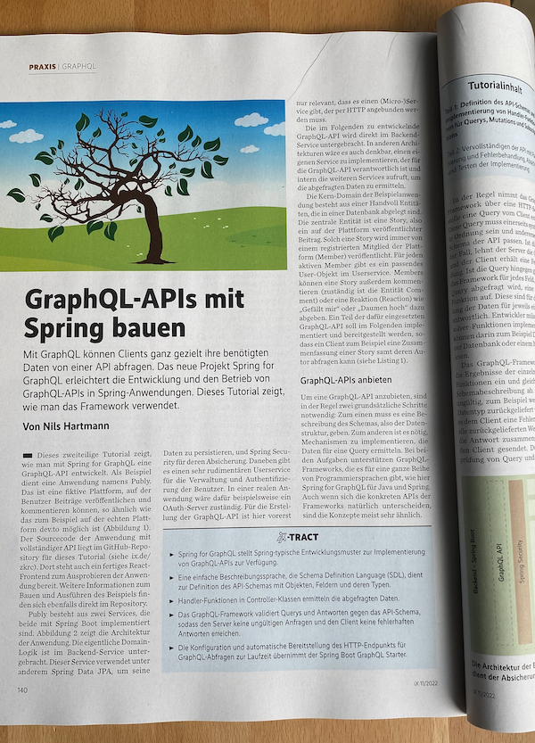

# Beispiel-Code für das iX Tutorial "GraphQL-APIs mit Spring bauen"

## Links zum Heft

Teil 1: [iX 11/2022](shop.heise.de/ix-11-2022/PDF)
Teil 2: ix 12/2022

## Verzeichnisse

* `teil_01`. Der Stand nach dem ersten Teil des Tutorials
* `complete` Die fertige Beispiel-Anwendung. Enthält auch Code, der nicht im Tutorial beschrieben ist.

In den Verzeichnissen gibt es jeweils eine `README.md`-Datei, in der beschrieben ist,
wie der jeweilige Stand gestartet werden kann.

Viel Spaß beim Arbeiten mit Spring for GraphQL! 😊

Bei Fragen oder Problemen stehe ich gerne zur Verfügung. Kontakt: [https://nilshartmann.net](https://nilshartmann.net)
